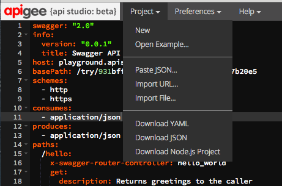

# Getting stuff into your project

* **New** -- Creates a new project with a new base path. By default, the new project is a "hello world" API. 

* **Open example** -- Lets you open a sample Swagger document in the editor. 

* **Paste JSON** -- Let's you paste Swagger JSON into your project and validates what you paste. 

* **Import URL** -- Import Swagger JSON via a URL. The JSON is immediately validated when you import it. 

* **Import File** -- Import Swagger JSON from a file. The JSON is immediately validated when you import it. 

# Downloading stuff from your project

* **Download YAML** -- Download the Swagger model to a file in YAML format. 

* **Download JSON** -- Download the Swagger model to a file in JSON format. 

* **Download Node.js project** -- Download the API as a Node.js project. Once you have your project, you can run it and test it locally, implement path endpoint logic in Node.js controller files, and deploy to any Cloud container that supports Node.js. See "Implementing a controller" to get started.

