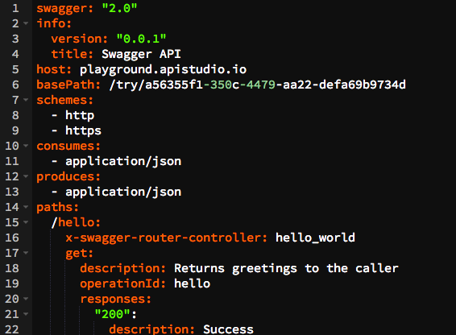
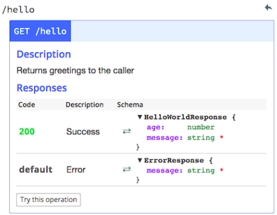
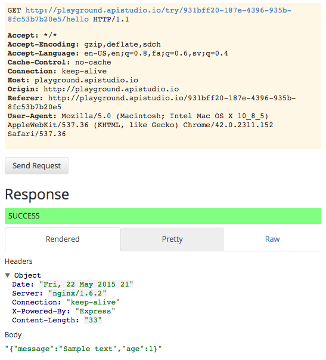

* [A few words about API Studio](#words)
* [Define your API model using Swagger](#define)
* [The Project menu](#project)
* [Generate API docs](#docs)
* [Generate simulated responses](#simulate)
* [Try stuff out](#try)

***

# API Studio

# A few words about API Studio
* It's free
* Easy to understand and use
* Supports model-first API development in Swagger
* Validates your Swagger automatically, as you work
* Let's you download your work into a Node.js project
* Based on the popular Swagger Editor
* Generates API docs for you
* Lets you run your API with simulated responses

# Define your API model using Swagger

You define your API in the Swagger editor. This is the playground! 

You can define API paths and operations and response schema, and while you type, API Studio automatically validates your Swagger and generates API documenation. 

Everything is in YAML, so it's easy to read and straightforward. The model must conform to the Swagger specification. 

Be careful, the validator is very picky! But you can easily correct any errors as you go.

# The Project menu

Let's you create new projects and import and export stuff. See [About the Project menu](./project.md).

# API docs automatically!

As mentioned before, as you develop your API model in the editor, Swagger Studio generates docs for you automatically. The code and the docs are one. Nothing ever gets out of sync.

# Simulated responses

This slider button lets you enable and disable the simulator. When you're running in the Studio, you'll usually want this to be ON. The key is that as long as you're in simulator mode, you want the API host and basepath to point to the API Studio environment:


host: playground.apistudio.io
basePath: /try/931bff20-187e-4396-935b-8fc53b7b20e5


If you want to point your API to a real backend, then change these values to reflect that backend before turning the simulator off. See [About the simulator](./simulator.md).

# Try stuff out

As expected, the **Try this operation** button lets you run your API directly from the Studio. 

In this picture, we "try" the `/hello` path, and the Studio returns a simulated response.

